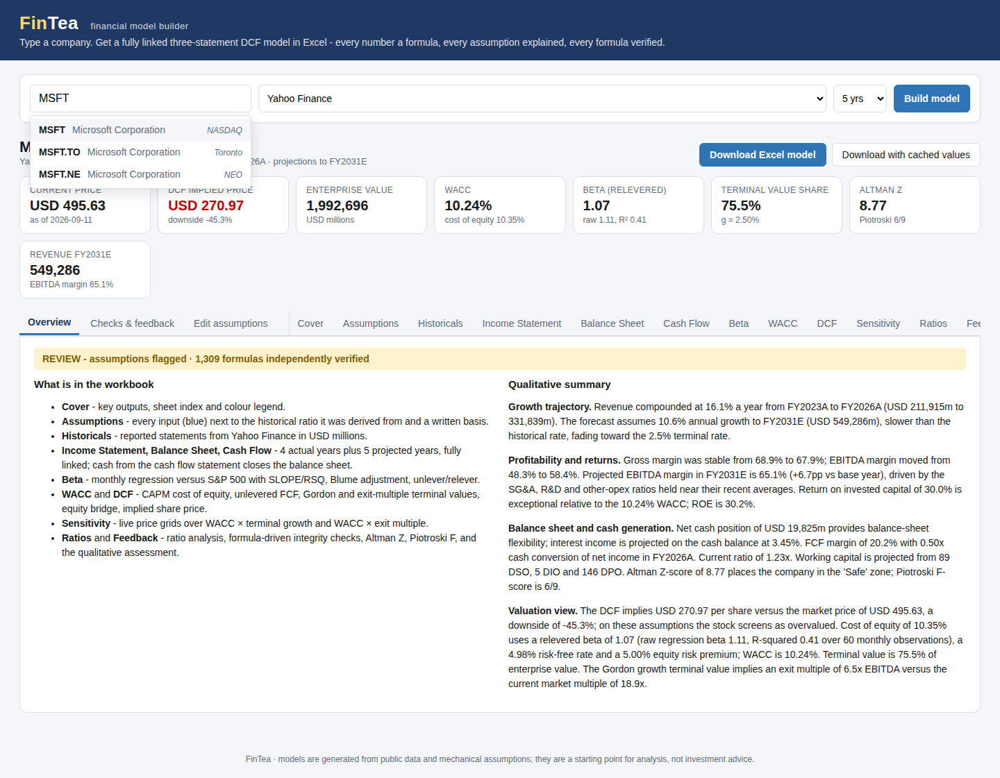
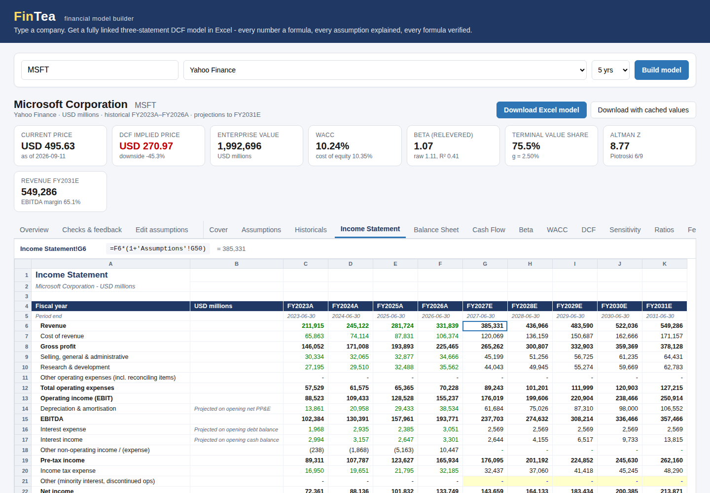
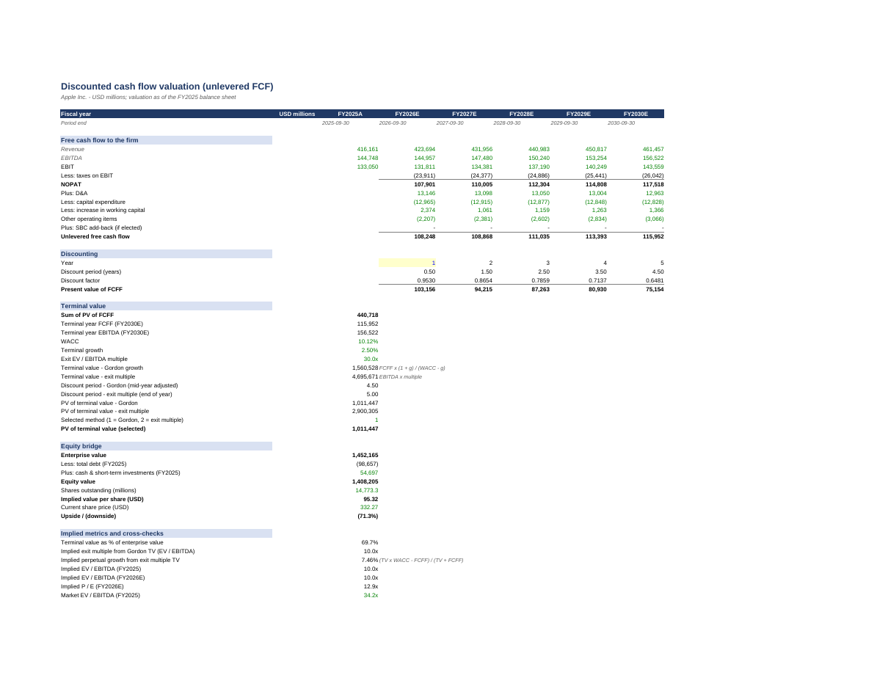

# FinTea - financial model builder

Type a company name or ticker and get a complete, formula-driven, investment-banking-grade
financial model as a downloadable Excel workbook - plus an interactive preview, editable
assumptions and quantitative / qualitative feedback.

**Live demo (GitHub Pages): https://abhisheksi2o.github.io/FinTea/** - 57 companies pre-built and
verified, refreshed nightly; edit assumptions and the model recalculates in your browser.

```
$ ./run.sh            # full app with live data for any listed company; open http://localhost:8000
```



## What you get

Every workbook contains twelve sheets. **Every projected number is a live Excel formula** that
traces back to the blue input cells on the Assumptions sheet; nothing is pasted as a value.

| Sheet | Content |
|---|---|
| Cover | Key outputs (linked), sheet index with hyperlinks, colour legend |
| Assumptions | Every input with its **basis** (how it was derived, which years, which formula); historical ratios shown beside each projected driver |
| Historicals | Reported statements from the data source, in millions, with the source field name |
| Income Statement | Actuals reconciled exactly to reported EBIT and net income, then projections (revenue growth, margins, interest on opening balances, tax) |
| Balance Sheet | Working capital from DSO/DIO/DPO, PP&E roll-forward, debt schedule, equity roll-forward; **balances by construction** with a check row |
| Cash Flow | CFO / CFI / CFF; ending cash feeds the balance sheet |
| Beta | 60 monthly returns vs the benchmark index: `SLOPE`, `INTERCEPT`, `RSQ`, `CORREL`, covariance/variance cross-check, Blume adjustment, Hamada unlever / relever |
| WACC | CAPM cost of equity, after-tax cost of debt, market and target weights |
| DCF | Unlevered FCF, mid-year discounting, Gordon-growth and exit-multiple terminal values, equity bridge, implied share price and upside, implied multiples |
| Sensitivity | Two 5x5 grids of implied share price (WACC x terminal growth, WACC x exit multiple) - each cell recomputes the DCF |
| Ratios | Growth, margins, ROE / ROA / ROIC, cash conversion, liquidity, leverage, working-capital days, per-share data |
| Feedback | 19 formula-driven integrity and reasonableness checks (PASS / FLAG / FAIL), Altman Z-score, Piotroski F-score, and a written qualitative assessment |

Formatting follows banking convention: blue inputs on a pale-yellow fill, black formulas,
green cross-sheet links, bold totals, negatives in parentheses, zeros as dashes, frozen headers,
named ranges (`WACC`, `ImpliedSharePrice`, `EnterpriseValue`, `SelectedBeta`, ...).





## Accuracy: two engines must agree

FinTea does not trust its own formulas. The model is defined once as an expression tree that is
**evaluated in Python** and **rendered to Excel formulas** from the same source. After the workbook
is written it is recalculated by a headless LibreOffice Calc instance and every formula cell
(about 1,300 per model) is compared with the Python value. A model is only reported as
"verified" when the two independent engines agree on every cell (typical max difference < 1e-8).
The verification result is shown in the UI and returned by the API.

## Data sources

| Source | Status | Configuration |
|---|---|---|
| Yahoo Finance | Free, default | none |
| Bloomberg (Desktop API / B-PIPE) | Adapter included | `pip install blpapi` on a machine with a Terminal; `BLOOMBERG_HOST`, `BLOOMBERG_PORT` |
| Financial Modeling Prep | Adapter included | `FMP_API_KEY` |
| Alpha Vantage | Adapter included | `ALPHAVANTAGE_API_KEY` |
| Offline sample | Bundled snapshots (MSFT, AAPL, NVDA) | none - used for tests and demos |

All sources are normalised into one schema (`backend/fintea/providers/base.py`); accounting
identities fill gaps (e.g. total liabilities = total assets - total equity) and every fix is
logged in the workbook's data-quality notes.

Optional AI commentary: set `ANTHROPIC_API_KEY` and the Feedback tab gains an analyst-style
review generated by Claude from the model's own numbers (`FINTEA_LLM_MODEL` selects the model).

## Static site (GitHub Pages)

GitHub Pages cannot run the Python backend, so the workflow in `.github/workflows/pages.yml`
builds the site on every push and nightly: it runs the tests, builds and LibreOffice-verifies a
model for each ticker in `scripts/build_site.py` (falling back to the bundled snapshot when the
live source is unavailable), and pushes the JSON, the `.xlsx` files and the frontend built with
`VITE_STATIC=1` to the `gh-pages` branch, which GitHub Pages serves. In static mode the frontend:

* lists the pre-built companies and loads their full model JSON;
* recalculates every formula in the browser when you edit assumptions (`frontend/src/engine.ts`
  implements the same Excel semantics as the Python engine);
* writes the edited model to Excel client-side with ExcelJS, including formulas and formatting.

Live builds of arbitrary tickers, a different projection horizon and the AI commentary need the
full app (`./run.sh` or Docker).

## Architecture

```
frontend/   React + Vite + TypeScript single-page app (search, sheet grid with formula bar,
            assumptions editor, feedback, download)
backend/
  fintea/sheet/       expression AST + in-memory workbook (evaluate in Python, render to Excel)
  fintea/providers/   Yahoo, Bloomberg, FMP, Alpha Vantage, sample; normalisation
  fintea/model/       assumptions derivation, model builder (all sheets), feedback, optional LLM
  fintea/excel/       openpyxl writer (formatting) and LibreOffice verifier
  fintea/api/         FastAPI routes; fintea/service.py orchestrates and caches models
  tests/              expression engine, model integrity, LibreOffice recalculation, API
```

### API

| Method | Path | Purpose |
|---|---|---|
| GET | `/api/providers` | data sources and availability |
| GET | `/api/search?q=apple&provider=yahoo` | symbol lookup |
| POST | `/api/models` | `{query, provider, years, overrides}` -> full model JSON (summary, assumptions, feedback, verification, sheets) |
| POST | `/api/models/{id}/rebuild` | rebuild with assumption overrides, no re-fetch |
| GET | `/api/models/{id}/download` | the .xlsx (`?recalculated=1` for a copy with cached values) |

Interactive docs at `/docs`.

## Development

```
cd backend && pip install -r requirements.txt && pytest -q      # 25 tests incl. LibreOffice verification
cd backend && uvicorn fintea.main:app --reload                   # API on :8000
cd frontend && npm install && npm run dev                        # UI on :5173 (proxies /api)
```

LibreOffice (`libreoffice-calc`) is required for formula verification; without it the model still
builds and verification is reported as skipped. `docker build -t fintea . && docker run -p 8000:8000 fintea`
gives a complete environment.

## Methodology notes

* Revenue growth starts at the 3-year CAGR and fades linearly toward terminal growth; margins and
  opex ratios are 3-year averages; working capital uses latest-year DSO / DIO / DPO.
* D&A is a percentage of opening net PP&E so it grows with the asset base; capex fades from the
  latest ratio to its 3-year average.
* Interest is computed on opening balances, so the model has no circular references.
* Beta: 5 years of monthly total returns vs the local benchmark index, Blume-adjusted, unlevered at
  the current market D/E and relevered at the target structure. Risk-free = US 10-year yield.
* FCFF = NOPAT + D&A - capex - increase in working capital (+ SBC only if elected); terminal value by
  Gordon growth (primary) with the exit multiple as cross-check; mid-year convention.
* Models are generated from public data and mechanical assumptions. They are a starting point for
  analysis, not investment advice.
