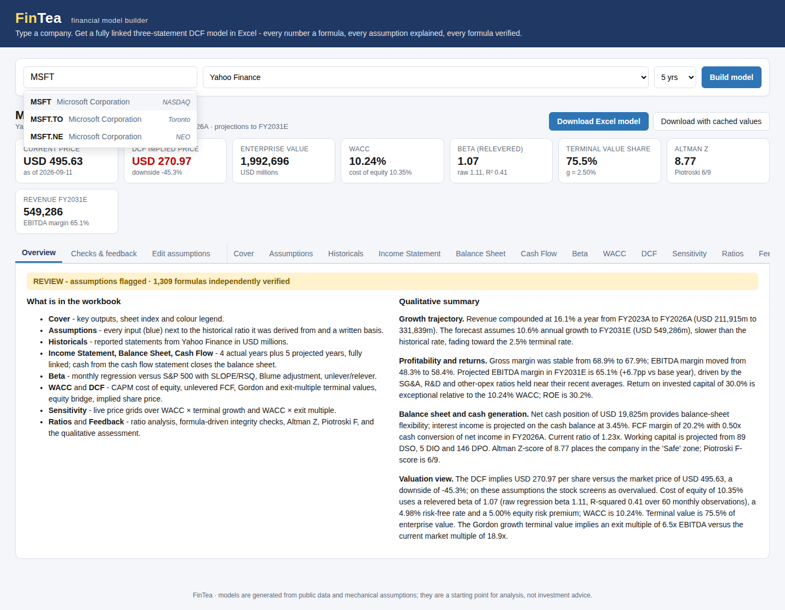
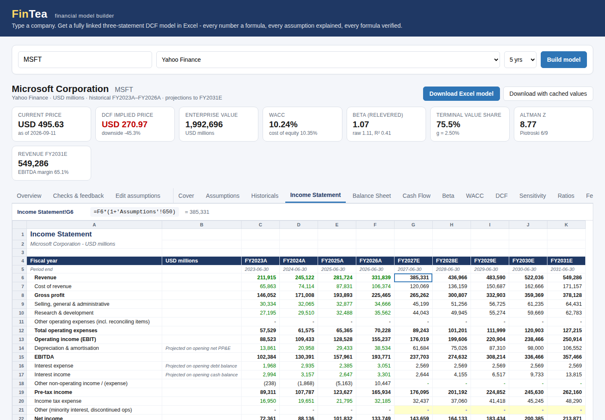
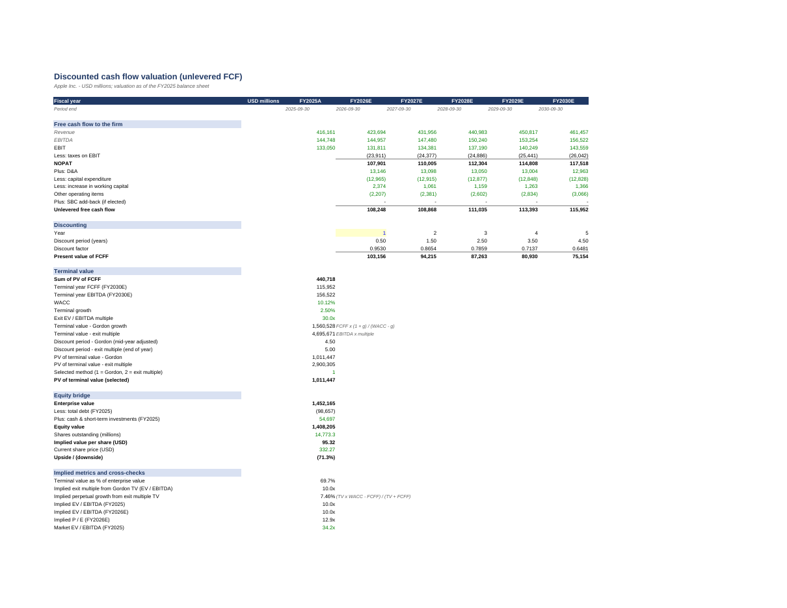

# FinTea - financial model builder

Type a company name or ticker and get a complete, formula-driven, investment-banking-grade
financial model as a downloadable Excel workbook - plus an interactive preview, editable
assumptions and quantitative / qualitative feedback.

**Live site (GitHub Pages): https://abhisheksi2o.github.io/FinTea/** - about 2,450 companies pre-built
and refreshed nightly: every NIFTY Total Market constituent in India plus the S&P 500, FTSE 100/250,
EURO STOXX 50, DAX, CAC 40, Nikkei 225, Hang Seng, S&P/TSX 60, S&P/ASX 200, Straits Times and
KOSPI 200. Edit assumptions and the model recalculates in your browser; download writes the Excel file.

```
$ ./run.sh            # full app with live data for any listed company; open http://localhost:8000
```



## Default risk analyzer

The second product in the same app: type a company and get a **default-risk report** as a formula-driven,
independently verified Excel workbook plus an interactive dashboard. Switch the mode selector next to the
search bar to *Default risk analysis*. The web view leads with the market-implied and rating-implied
probabilities of default, the Altman Z'' zone, model agreement and the leverage / coverage / liquidity trends,
then the distress signal index, stress tests, per-model tables, DuPont analysis, editable inputs (rebuild in
one click), a data-quality audit and every sheet of the workbook with its formulas. The search bar offers
keyboard-navigable suggestions with exchange and sector, recent searches and example chips.

| Sheet | Content |
|---|---|
| Cover / Assessment | Key outputs, sheet index, and a written assessment generated from the model outputs (solvency, liquidity, coverage, market-implied risk, earnings quality, model agreement, caveats, data quality) |
| Dashboard | Distress signal index with editable weights, probability of default by model with horizon and measure, model verdicts, key credit ratios and ten native Excel charts |
| Inputs | Market inputs, model choices, every published coefficient and threshold with its source, Damodaran rating tables, S&P default-rate table - all blue cells the formulas reference |
| Financials / Ratios | Reported statements with the Yahoo field per line; liquidity, leverage, coverage, profitability, cash-flow and market-based ratios by year |
| DuPont | Three-step (net margin x asset turnover x equity multiplier) and five-step (tax burden x interest burden x EBIT margin x asset turnover x equity multiplier) ROE decomposition by year, with charts |
| Altman Z | Z (1968), Z' (1983), Z'' (1995) with zones, the EM score and its bond-rating equivalent, an EBIT stress case |
| Piotroski F, Beneish M | Nine fundamental-strength signals and eight earnings-manipulation indices, year by year |
| Distress Models | Ohlson O (logit, Ohlson's 3.8% cut-off), Zmijewski X (probit), Springate, Grover, Taffler |
| Merton PD | Equity volatility from the daily price table, naive distance to default (Bharath & Shumway 2008), the iterated two-equation Merton solve with formula residual checks, stress tests, expected loss |
| Synthetic Rating | Interest coverage -> rating -> default spread (Damodaran), Altman EM-score rating, historical default rates by rating class, optional CDS-implied PD |
| Data Quality | 25 live integrity and applicability checks (PASS / FLAG / FAIL), model applicability matrix, source traceability, and the LibreOffice verification statement |

The only Python-computed numbers in the workbook are the two Merton solver outputs (asset value and
volatility), and the workbook re-derives the market inputs from them as a check. Everything else is a
formula, so the report recalculates when an input is edited; every formula cell is recalculated by
LibreOffice and compared with the engine before the file is served. Companies with a single fiscal
year (fresh-start accounting) and financial institutions are handled explicitly: year-over-year models
are marked unavailable and accounting-ratio models carry no weight for banks and insurers.

API: `POST /api/risk {query, provider, overrides}`, `POST /api/risk/{id}/rebuild`, `GET /api/risk/{id}/download`.
Offline snapshots for a distressed company (Beyond Meat), a post-restructuring single-year company
(Wolfspeed) and a bank (HDFC Bank) are bundled for tests and demos.

## What you get (financial model)

Every workbook contains twelve sheets. **Every projected number is a live Excel formula** that
traces back to the blue input cells on the Assumptions sheet; nothing is pasted as a value.

| Sheet | Content |
|---|---|
| Cover | Key outputs (linked), sheet index with hyperlinks, colour legend |
| Assumptions | Every input with its **basis** (how it was derived, which years, which formula); historical ratios shown beside each projected driver |
| Historicals | Reported statements from the data source, in millions, with the source field name |
| Income Statement | Actuals reconciled exactly to reported EBIT and net income, then projections (revenue growth, margins, interest on opening balances, tax) |
| Balance Sheet | Working capital from DSO/DIO/DPO, PP&E roll-forward, debt schedule, equity roll-forward; **balances by construction** with a check row |
| Cash Flow | CFO / CFI / CFF; ending cash feeds the balance sheet |
| Beta | 60 monthly returns vs the benchmark index: `SLOPE`, `INTERCEPT`, `RSQ`, `CORREL`, covariance/variance cross-check, Blume adjustment, Hamada unlever / relever |
| WACC | CAPM cost of equity, after-tax cost of debt, market and target weights |
| DCF | Unlevered FCF, mid-year discounting, Gordon-growth and exit-multiple terminal values, equity bridge, implied share price and upside, implied multiples |
| Sensitivity | Two 5x5 grids of implied share price (WACC x terminal growth, WACC x exit multiple) - each cell recomputes the DCF |
| Ratios | Growth, margins, ROE / ROA / ROIC, cash conversion, liquidity, leverage, working-capital days, per-share data |
| Feedback | 19 formula-driven integrity and reasonableness checks (PASS / FLAG / FAIL), Altman Z-score, Piotroski F-score, and a written qualitative assessment |

For the full credit picture (Altman family, Piotroski, Beneish, Ohlson, Zmijewski, Springate, Grover, Taffler, Merton, synthetic rating) use the default risk analyzer above.

Formatting follows banking convention: blue inputs on a pale-yellow fill, black formulas,
green cross-sheet links, bold totals, negatives in parentheses, zeros as dashes, frozen headers,
named ranges (`WACC`, `ImpliedSharePrice`, `EnterpriseValue`, `SelectedBeta`, ...).





## Accuracy: two engines must agree

FinTea does not trust its own formulas. The model is defined once as an expression tree that is
**evaluated in Python** and **rendered to Excel formulas** from the same source. After the workbook
is written it is recalculated by a headless LibreOffice Calc instance and every formula cell
(about 1,300 per model) is compared with the Python value. A model is only reported as
"verified" when the two independent engines agree on every cell (typical max difference < 1e-8).
The verification result is shown in the UI and returned by the API.

## Data sources

| Source | Status | Configuration |
|---|---|---|
| Yahoo Finance | Free, default | none |
| Bloomberg (Desktop API / B-PIPE) | Adapter included | `pip install blpapi` on a machine with a Terminal; `BLOOMBERG_HOST`, `BLOOMBERG_PORT` |
| Financial Modeling Prep | Adapter included | `FMP_API_KEY` |
| Alpha Vantage | Adapter included | `ALPHAVANTAGE_API_KEY` |
| Offline sample | Bundled snapshots (MSFT, AAPL, NVDA) | none - used for tests and demos |

All sources are normalised into one schema (`backend/fintea/providers/base.py`); accounting
identities fill gaps (e.g. total liabilities = total assets - total equity) and every fix is
logged in the workbook's data-quality notes.

### AI commentary

The Feedback tab can carry an analyst-style review written by Claude from the model's own numbers
(key outputs, every assumption with its basis, the check results and the rules-based narrative).
Three ways to get it:

* **Full app**: set `ANTHROPIC_API_KEY` (and optionally `FINTEA_LLM_MODEL`, default `claude-opus-5`);
  every build then includes the commentary.
* **Live site, pre-generated**: add a repository secret named `ANTHROPIC_API_KEY` (Settings ->
  Secrets and variables -> Actions). The nightly build then writes a commentary for every company
  and caches it in `commentary/` on the `gh-pages` branch; a company is only re-reviewed when its
  valuation picture changes materially (upside bucket, WACC, check status). Expect roughly
  2,400 reviews on the first run and a few hundred on subsequent nights; at Claude Opus 5 rates
  that is on the order of USD 100 for the first run. Set the repository variable
  `FINTEA_LLM_MODEL` to use a different model.
* **Live site, your own key**: on any company's Feedback tab, paste an Anthropic API key and click
  "Generate commentary". The key stays in your browser (optionally remembered on the device) and
  is sent only to api.anthropic.com; the commentary also works for models you have edited.

## Static site (GitHub Pages)

GitHub Pages cannot run the Python backend, so the workflow in `.github/workflows/pages.yml`
builds the site on every push and nightly. The company universe lives in `data/universe.csv`
(generated by `scripts/universe.py` from the NSE constituent file and the index articles on
Wikipedia, every symbol validated against Yahoo Finance). The build is sharded across 12 parallel
runners: each shard fetches live data, builds the model for its companies, verifies a 10% sample
with LibreOffice, and stores each model as compressed JSON (`models/{SYMBOL}.json.gz`, about
40 KB); a final job merges the shard indexes, adds the frontend built with `VITE_STATIC=1`, and
pushes everything to the `gh-pages` branch, which GitHub Pages serves. Excel files are written
in the browser on download, so no workbooks need to be stored.

"All listed companies" is not feasible for a static, nightly-refreshed site (roughly 50,000
listings worldwide, tens of thousands of data requests a night), so the universe is the set of
index constituents above; any other listed company can be built with the full app. In static mode the frontend:

* lists the pre-built companies with market and index filters and loads their compressed model JSON;
* recalculates every formula in the browser when you edit assumptions (`frontend/src/engine.ts`
  implements the same Excel semantics as the Python engine);
* writes the edited model to Excel client-side with ExcelJS, including formulas and formatting.

Live builds of arbitrary tickers, a different projection horizon and the AI commentary need the
full app (`./run.sh` or Docker).

## Architecture

```
frontend/   React + Vite + TypeScript single-page app (search, sheet grid with formula bar,
            assumptions editor, feedback, download)
backend/
  fintea/sheet/       expression AST + in-memory workbook (evaluate in Python, render to Excel)
  fintea/providers/   Yahoo, Bloomberg, FMP, Alpha Vantage, sample; normalisation
  fintea/model/       assumptions derivation, model builder (all sheets), feedback, optional LLM
  fintea/risk/        default-risk analyzer: model specs (coefficients, tables, sources), inputs, Merton solver,
                      workbook builder (13 sheets + charts), written assessment, service
  fintea/excel/       openpyxl writer (formatting) and LibreOffice verifier
  fintea/api/         FastAPI routes; fintea/service.py orchestrates and caches models
  tests/              expression engine, model integrity, LibreOffice recalculation, API
```

### API

| Method | Path | Purpose |
|---|---|---|
| GET | `/api/providers` | data sources and availability |
| GET | `/api/search?q=apple&provider=yahoo` | symbol lookup |
| POST | `/api/models` | `{query, provider, years, overrides}` -> full model JSON (summary, assumptions, feedback, verification, sheets) |
| POST | `/api/models/{id}/rebuild` | rebuild with assumption overrides, no re-fetch |
| GET | `/api/models/{id}/download` | the .xlsx (`?recalculated=1` for a copy with cached values) |
| POST | `/api/risk` | `{query, provider, overrides}` -> default-risk analysis JSON (summary, inputs, feedback, verification, charts, sheets) |
| POST | `/api/risk/{id}/rebuild` | re-run with input overrides (volatility, default point, weights, stress shocks, CDS spread ...) |
| GET | `/api/risk/{id}/download` | the default-risk .xlsx (`?recalculated=1` for cached values) |

Interactive docs at `/docs`.

## Development

```
cd backend && pip install -r requirements.txt && pytest -q      # 25 tests incl. LibreOffice verification
cd backend && uvicorn fintea.main:app --reload                   # API on :8000
cd frontend && npm install && npm run dev                        # UI on :5173 (proxies /api)
```

LibreOffice (`libreoffice-calc`) is required for formula verification; without it the model still
builds and verification is reported as skipped. `docker build -t fintea . && docker run -p 8000:8000 fintea`
gives a complete environment.

## Methodology notes

* Revenue growth starts at the 3-year CAGR and fades linearly toward terminal growth; margins and
  opex ratios are 3-year averages; working capital uses latest-year DSO / DIO / DPO.
* D&A is a percentage of opening net PP&E so it grows with the asset base; capex fades from the
  latest ratio to its 3-year average.
* Interest is computed on opening balances, so the model has no circular references.
* Beta: 5 years of monthly total returns vs the local benchmark index, Blume-adjusted, unlevered at
  the current market D/E and relevered at the target structure. Risk-free = US 10-year yield.
* FCFF = NOPAT + D&A - capex - increase in working capital (+ SBC only if elected); terminal value by
  Gordon growth (primary) with the exit multiple as cross-check; mid-year convention.
* Default risk: published coefficients are used as-is (Altman 1968/1983/1995, Piotroski 2000, Beneish 1999,
  Ohlson 1980, Zmijewski 1984, Springate 1978, Grover 2001, Taffler 1983, Bharath & Shumway 2008, Damodaran's
  coverage tables, S&P average cumulative default rates); every coefficient and threshold is a blue cell on the
  Inputs sheet with its source. Ohlson's SIZE term uses total assets in US dollars deflated by the lagged GNP
  price index (1968 = 100). The distress signal index is an uncalibrated weighted average of model signals, not a
  probability of default; the headline probabilities are the Merton and rating-implied ones, each tagged with
  its horizon and measure.
* Models are generated from public data and mechanical assumptions. They are a starting point for
  analysis, not investment advice.
